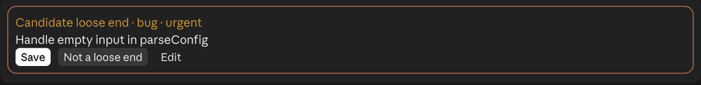
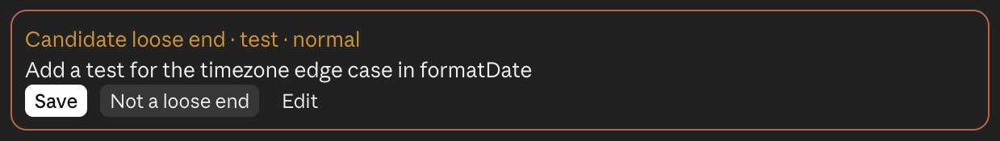
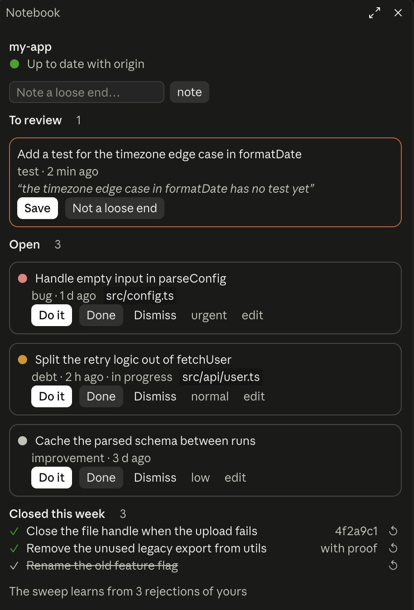
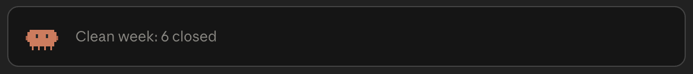

<div align="center">


# loose-ends

**Never lose the "I'll leave that for later" again.**

A mod for [Claude Code](https://claude.com/claude-code) that catches the work Claude leaves behind,
lets you keep what matters, and puts the next thing to do one click away.

[](LICENSE)
[](CHANGELOG.md)
[](https://claude.com/claude-code)
[](#language)



</div>

---

## Why

Every long Claude Code session ends with a trail of half-sentences:

> *"…the retry logic in `fetchUser` should be split out, but that's outside this change."*
> *"I skipped the timezone edge case in `formatDate` for now."*
> *"There's a warning about the old flag; leaving it."*

They scroll away, and a week later nobody remembers them. **loose-ends** notices
them while you work, asks you once whether they are worth keeping, and keeps the
ones you want in your repo, without a single file or commit on your branches.

## Install

In Claude Code:

```text
/plugin marketplace add MiguelProz/claude-loose-ends
/plugin install loose-ends@claude-loose-ends
/reload-plugins
```

That's it. Work as usual; loose ends start showing up on their own.

## How it works

**1. Claude leaves something behind → you get a candidate.**
Claude proposes it itself, or Claude Haiku spots it in a long answer, quoting
the exact sentence. It appears under the message where it was born:



**Save** keeps it, **Not a loose end** drops it (and teaches the mod not to
propose things like it), **Edit** fixes the wording.

**2. The band always shows what's next.**
Above the prompt, Chispa and the most urgent open loose end, its file and a
**Do it** button that hands it straight to Claude. Its border turns orange when
something waits for review, red when something is urgent, green when you've just
closed one.

**3. Done means proven.**
Nothing closes on its own. When an answer or a commit shows a loose end done, you
get a **Resolved?** with the sentence that proves it, and you confirm.

**4. The Notebook keeps the whole list.**
`/loose-ends` opens it: what's to review, what's open (priority, edit, Do it,
Done, Dismiss) and what you closed this week.



And when there's nothing left, Chispa takes a break:



## Features

- **Low noise by design.** A fixed filter drops what isn't work on the code
  (verifying, waiting, deciding, pushing, deploying…), repeats, and anything
  close to what you already rejected. Unreviewed candidates expire after 7 days.
- **Lives in git, not in your tree.** Loose ends are stored in the ref
  `refs/loose-ends/items` of the repo they belong to: nothing in `git status`,
  no commits on your branches, the same list in every worktree.
- **Travels with the repo.** With an `origin`, the list is fetched when a session
  starts and pushed after a `git push` (it asks the first time), so it follows
  you across machines and teammates.
- **Reminders in passing.** When Claude reads or edits a file with open loose
  ends, it gets a one-line reminder.
- **Do it, even mid-turn.** Pressing Do it while Claude is answering queues it
  for when the turn ends.
- **English and Spanish**, picked automatically.
- **Works in the terminal too**, as a single line with Chispa's face.

## Chispa

| | | |
|:-:|:-:|:-:|
|  |  |  |
| Loose ends to review | Something urgent | A close or a commit |
|  |  |  |
| Claude is working | Watching | 30 quiet minutes |

## FAQ

**Will it flood me with suggestions?**
No. Haiku only reads answers of 500 characters or more, proposes at most two per
answer, must quote your conversation literally, and everything passes the filter
first. Each "Not a loose end" makes it stricter.

**Does it touch my code or my branches?**
Never. It writes only to `refs/loose-ends/*` (plus a small `loose-ends-seen.json`
in the git directory). Your working tree and history stay as they are.

**Does it cost anything?**
The sweep uses Claude Haiku through Claude Code, like any other model call, once
per long answer.

**Can my team share the list?**
Yes, through `origin`: everyone who fetches the repo sees the same loose ends,
merged by id.

**What happens outside a git repo?**
Nothing is stored.

## Requirements

Claude Code 2.1.287 or later (tested with 2.1.288). loose-ends is a *mod*: it is
built on Claude Code's mods API (function hooks), which is in early access and
may change between releases.

## Update

Claude Code only sees a new version after it refreshes its copy of the
marketplace. First the marketplace, then the plugin:

```bash
claude plugin marketplace update claude-loose-ends
claude plugin update loose-ends@claude-loose-ends
```

Or inside Claude Code: `/plugin` → Marketplaces → claude-loose-ends →
`Update marketplace`, then Installed → loose-ends → update, and restart the
session. `Enable auto-update` in the same menu keeps it fresh by itself.

## Language

English and Spanish. The `language` option takes `auto` (the default), `es` or
`en`; change it in `/config` (loose-ends → Language). With `auto`, the first of
`LC_ALL`, `LC_MESSAGES` and `LANG` that is set decides; on macOS, where desktop
apps usually get none, the system language does. Spanish when it starts with
`es`, English otherwise. In Spanish the Notebook is `/pendientes`. The stored
loose ends are the same in both languages.

## Privacy

- Loose ends are written to `refs/loose-ends/items` in the repo they belong to,
  plus a small `loose-ends-seen.json` in that repo's git directory (what the last
  session saw, to tell what changed). Nothing else is stored on your machine.
- If the repo has an `origin` and you allow it, that ref is pushed there. It does
  not show on GitHub's web pages, but anyone who can fetch the repo can read it.
- After a long answer, the mod asks Claude Haiku through Claude Code: it sends the
  answer (up to 12,000 characters), the texts of the open and waiting loose ends,
  the last ones you rejected, the subjects of the turn's commits and, when another
  repo was touched, the paths of the candidate repos. Nothing is sent anywhere
  else.

## Uninstall

```text
/plugin uninstall loose-ends@claude-loose-ends
```

Your loose ends stay in each repo. To remove them from one:

```bash
git update-ref -d refs/loose-ends/items
git update-ref -d refs/loose-ends/origin
git config --unset loose-ends.sync
rm "$(git rev-parse --git-common-dir)/loose-ends-seen.json"
git push origin --delete refs/loose-ends/items   # only if it was pushed
```

## Contributing

Issues and pull requests are welcome: bugs, false positives you keep rejecting,
ideas for Chispa. To work on it:

```bash
claude --plugin-dir ./loose-ends
cd loose-ends && claude plugin test && claude plugin validate . --strict
node ../scripts/git-smoke.mjs
```

`git-smoke.mjs` replays the mod's git commands with real git in a temporary folder
(a remote and two clones) and prints `OK` or the step that failed.
`chispa-media.mjs` writes Chispa's poses to `media/`, `chispa-gallery.mjs` draws
them all in one HTML page, and `sweep-audit.mjs <repo>` checks the candidates
already in a repo against this version's filters without calling Haiku. More
detail in [loose-ends/README.md](loose-ends/README.md); changes in
[CHANGELOG.md](CHANGELOG.md).

## License

[MIT](LICENSE) © 2026 Miguel Ángel Pérez García
